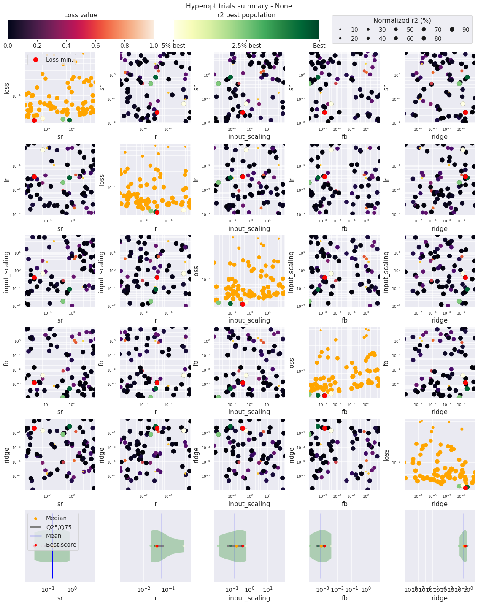
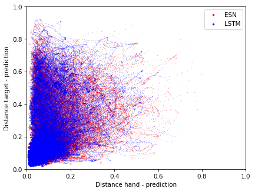

# Supplementary materials

## Impact of feedback on the ESN model

This has been evaluated by exploring the feedback scaling hyper-parameter, along with other classical hyper-parameters:
the spectral radius (`sr`), leak rate (`lr`), an input scaling, and the regularization parameter of the readout part (`ridge`).

This is the report generated by ReservoirPy on the hyper-parameter exploration. Every tested reservoir had 500 neurons. The spectral radius is explored between 0.01 and 10 (log-uniformly). The leak rate is explored between 0.001 and 1 (log-uniformly). The input scaling is explored between 10^-2 and 10^2 (log-uniformly). The regularization is explored between 10^-9 and 10 (log-uniformly). The feedback scaling is explored between 10^-4 and 10 (log-uniformly).

The diagonal plots displays the impact of each parameter individually on the used score. In the feedback scaling column, we observe that the best scores are obtained when the feedback is negligible.

## Distance to hand vs distance to target

For each time step, we record the distance between the model prediction and effective hand position, and the distance between the model prediction and the bottle position.

